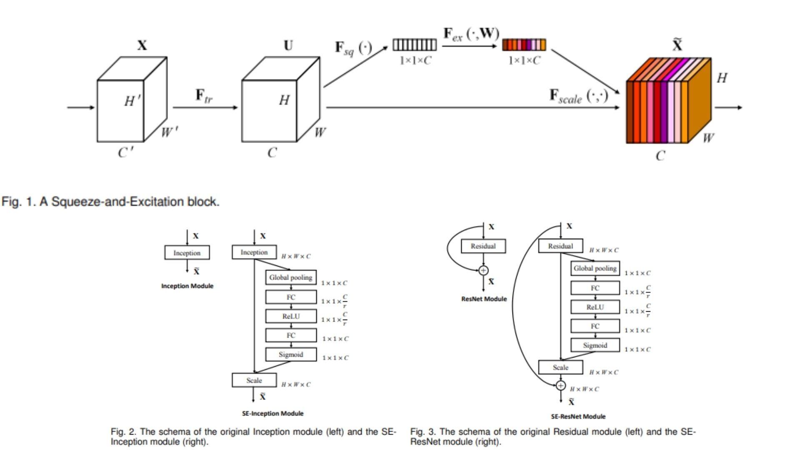
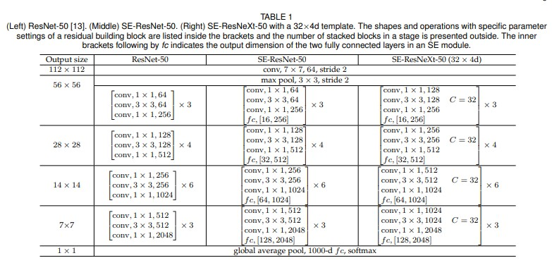
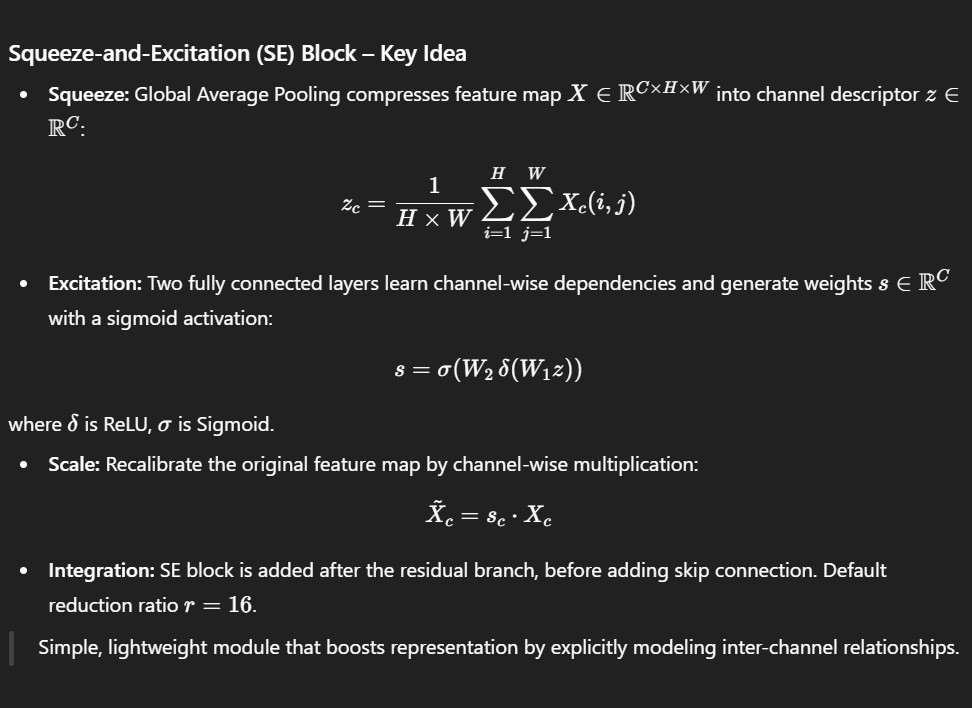

# 🌸 SE-ResNet PyTorch Implementation

This repository contains a PyTorch implementation of **SE-ResNet**, integrating **Squeeze-and-Excitation (SE) blocks** into **ResNet bottleneck and basic blocks**. The model is designed for **enhanced channel-wise feature recalibration**, improving representational power while keeping computation efficient.  

- Implemented **SE-ResNet** with **residual blocks** and **SE modules**.  
- Architecture:  
**Stem → Residual Blocks + SE → GlobalAvgPool → Flatten → FC**

> **Note on SE blocks:** Each SE module performs **squeeze (global pooling) → excitation (channel-wise scaling)**, allowing the network to emphasize informative features 
$$F_c(x)$$
dynamically.

**Paper reference:** [Squeeze-and-Excitation Networks (SE-ResNet)](https://arxiv.org/abs/1709.01507) 🍀

---

## 🖼 Overview – SE-ResNet Architecture

  
*Figure 1:* A Squeeze‑and‑Excitation (SE) block — shows the Squeeze + Excitation + Scale pipeline: global spatial info is pooled into a channel descriptor, then channel‑wise activations are learned and used to recalibrate feature maps. 

*Figure 2:* The schema comparing (left) a standard module (e.g. Inception or residual branch) and (right) its SE‑augmented version — illustrating how the SE block wraps around the transformation to add channel‑wise recalibration without disturbing spatial operations.

*Figure 3:* The SE‑ResNet module — shows how in a residual network the SE block is applied to the non‑identity branch, then summed with the identity connection. This integration enables dynamic channel‑wise attention within residual architectures.

---

  
*Table 1:* Network configurations (block counts, channel dimensions) for ResNet and SE‑ResNet variants, as reported in the original paper.  
 
> **Model highlights:**  
> - SE blocks **adaptively recalibrate channel-wise features**, boosting informative signals.  
> - Residual connections **preserve gradient flow** for stable deep network training.  
> - Global average pooling + flatten prepares features for the classifier.  
> - Homogeneous residual + SE topology ensures **scalability** across depths.

---

## 🧮 Key Mathematical Idea

  

---

## 🏗️ Model Architecture

```bash
SE-ResNet/
│
├── src/
│   ├── layers/
│   │   ├── conv_layer.py             # Standard convolution
│   │   ├── se_block.py               # Squeeze-and-Excitation module
│   │   ├── flatten_layer.py          # Flatten layer
│   │   ├── fc_layer.py               # Fully connected classifier
│   │   ├── pool_layers/
│   │   │   ├── maxpool_layer.py      # MaxPool
│   │   │   └── avgpool_layer.py      # Global/AdaptiveAvgPool for SE
│   │
│   ├── blocks/
│   │   └── residual_block.py         # Residual block + SE integration
│   │
│   ├── model/
│   │   └── se_resnet.py              # Full SE-ResNet: Stem + Residual+SE blocks + Classifier
│   │
│   └── config.py                      # Input size, num_classes, depth, reduction ratio
│
├── images/
│   ├── table1.jpg                     # Parameter/accuracy comparison
│   ├── figures.jpg                    # Figures 1-3 from the paper
│   └── math.jpg                       # Key SE block equations
│
├── requirements.txt
└── README.md
```
---

## 🔗 Feedback

For questions or feedback, contact: [barkin.adiguzel@gmail.com](mailto:barkin.adiguzel@gmail.com)
